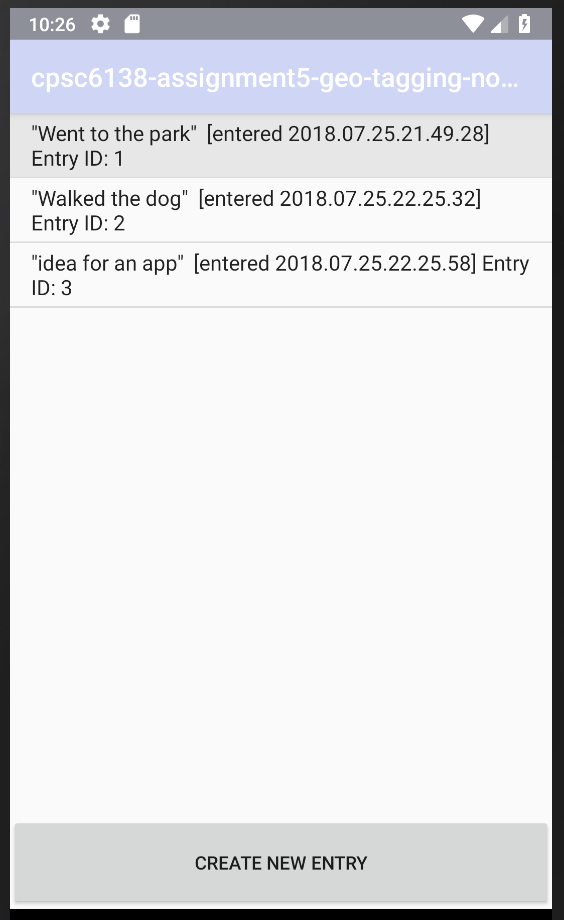
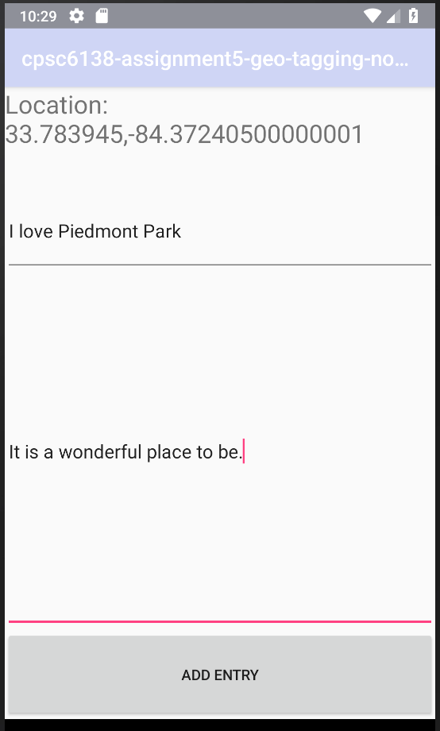
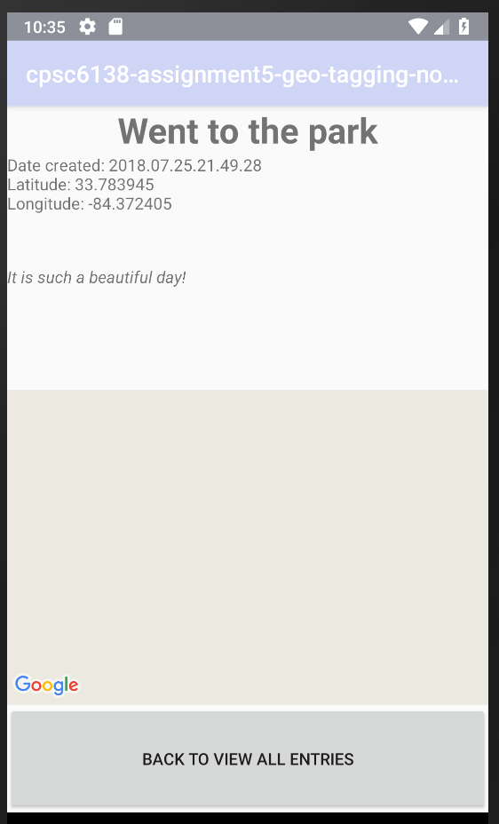

# cpsc6138-assignment5-geo-tagging-note-app

Jonathon Goodson

This app allows the user to take notes and will record the location where the note was taken.  

## View All Notes

Upon entering the app, the user is presented with all of his or her notes (see Figure 1).

## Create New Note

To create a new entry, click the "CREATE NEW ENTRY" button at the bottom of the screen.  Enter a subject for your note as well as the content of your note (see Figure 2).  To save, click "ADD ENTRY" and the bottom of the screen.

## View Individual Note

To view a single note, from the `VIEW ALL NOTES` screen (see Figure 1), click an entry (see Figure 3).

### Figure 1

### Figure 2

### Figure 3
